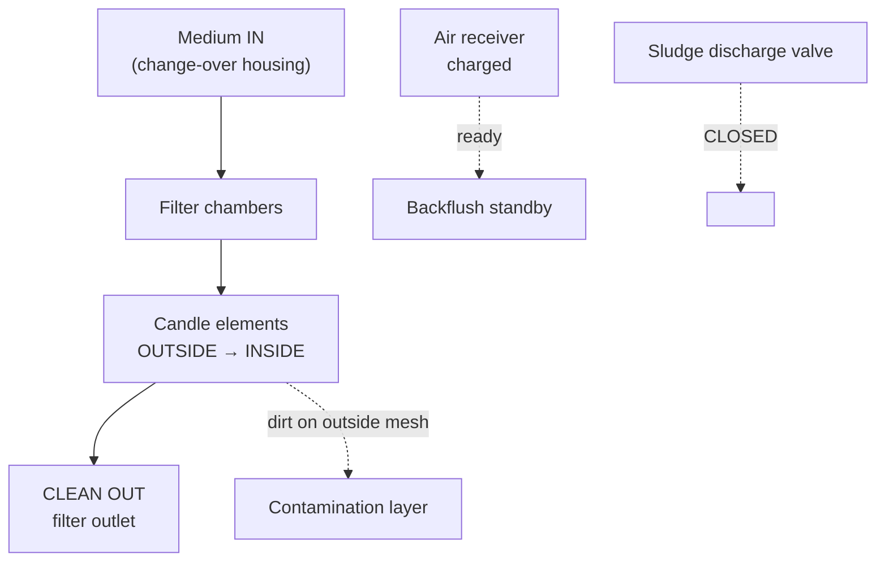
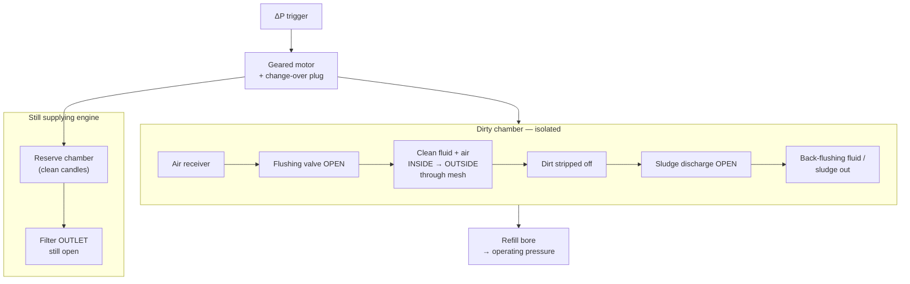

# BOLLFILTER TYP 6.61 — Filtration & Back-Flushing (2D / 3D Animation Guide)

**Source:** BOLLFILTER Protection Systems manual  
- **Section 5** — Filtration Phase (Drawing **Z32326 p.1** / Z33701 p.1)  
- **Section 6** — Back-Flushing Operation (Drawing **Z32326 p.2** / Z33701 p.2)  
**Application on your ship:** M/E F.O. auto back-flushing filter (P&ID 2536–2540, 34 µm) — same **operating principle**; confirm type plate onboard.

---

## Component list (for labels in animation)

| Label (EN) | Role in animation |
|------------|-------------------|
| Change-over system housing | Fluid enters from top; plug rotates between chambers |
| Chamber inlet | Path to filter chambers |
| Filter chambers | Multiple chambers; one in reserve during backflush |
| Candle elements (screw-in) | Mesh where dirt collects |
| Filter outlet | Clean medium to M/E F.O. line |
| Reserve chamber | Clean candles ready to take over filtration |
| Geared motor | Rotates change-over plug |
| Cam plate + limit switch | Stops plug at correct chamber |
| ΔP indicator / electrical contact | Starts backflush at setpoint |
| Sludge discharge valve | Opens → contamination out (→ F.O. OVFL TK on ship) |
| Solenoid valve (sludge) | Controls sludge valve |
| Flushing valve | Opens after chamber depressurized |
| Air receiver (LUFTSPEICHER) | Stores compressed air for backflush |
| Refill bore | Refills chamber with clean medium after backflush |
| Back-flushing fluid line | Bottom discharge path (drawing: SPUELFLUESSIGKEIT) |

---

## PHASE 1 — Filtration (Section 5)

### What happens

1. Medium (F.O.) flows **down** into **change-over system housing**.  
2. Through **chamber inlet** → **filter chambers** → **candle elements**.  
3. Flow through candles: **OUTSIDE → INSIDE**.  
4. **Contamination retained on filter mesh on the OUTSIDE** of candles.  
5. **Cleaned fluid** → **filter outlet** (ship: toward **FF-119-80A** / rail supply).  
6. **Solenoid** keeps **sludge discharge CLOSED**.  
7. **Air receiver** charged — ready for next backflush.

### 2D flow diagram



### ASCII — filtration cross-section (match drawing FILTRATIONSPHASE)

```text
                    [ MOTOR / GEAR ]
                           │
    ═══════════════════════╪══════════════════════  change-over housing
                           │
         ┌─────────────────┴─────────────────┐
         │  chamber    │  chamber (active)   │
         │  (reserve)  │  ║ ║ ║ ║ candles     │
         │             │  → → OUTSIDE to IN  │
         └───────────────────────────────────┘
                           │
                      CLEAN OUT ↓

    AIR RESERVOIR ═══╦═══  (pressure stored)
    ΔP gauge ───────┘     sludge valve ═══ CLOSED
```

### Animation cues (Scene 3)

- Blue arrows: **down** into housing, then **inward** through candle walls.  
- Brown dots: stick to **outer** surface of candles.  
- Green arrow: exit **outlet**.  
- Sludge valve icon: **red CLOSED**.  
- Air tank: gauge **full / ready**.

---

## PHASE 2 — Back-flushing (Section 6 + continuation text)

### Sequence table (animate in this order)

| Step | Event | Visual |
|------|--------|--------|
| **6.1** | Dirt on candles → **ΔP** rises → **electrical contact** triggers | ΔP gauge → limit; blink “START” |
| **6.2** | **Geared motor ON** — **change-over plug** rotates | Plug rotates animation |
| **6.3** | **Reserve chamber** (clean candles) connected to flow | Arrow shifts to reserve; **ΔP drops** immediately |
| **6.4** | **Cam plate + limit switch** — plug stops at chamber to be cleaned | Stop at dirty chamber |
| **6.5** | **Solenoid** — sludge discharge valve: air to **rear of shaft** → **valve OPENS** | Sludge valve opens downward |
| **6.6** | Pressure released from **isolated (dirty) chamber** | Pressure lines fade in chamber |
| **6.6a** | *(Note)* Air in **upper region of plug expands** — space for displaced fluid | Small expand animation on plug top |
| **6.7** | Control air to **flushing valve** (while sludge opening) | Pipe highlight to flushing valve |
| **6.8** | Chamber pressure released → **flushing valve OPENS** | Flushing valve open |
| **6.9** | **Air from receiver** pushes **clean fluid** **counter-current** through candle **mesh** | **INSIDE → OUTSIDE** reverse arrows |
| **6.10** | **Pressure drop** strips mesh; sludge out via **open sludge valve** | Brown particles down discharge |
| **6.11** | **Flushing period** — air flow continues short time | Timer 2–3 s on screen |
| **6.12** | Solenoid switches — **sludge valve CLOSES**; air to flushing valve **stops** | Valves close |
| **6.13** | Chamber **refilled** via **refill bore** until **operating pressure** | Level/pressure gauge rises |
| **6.14** | Delay cancelled — ready for **next** backflush | ΔP normal; motor idle |

### 2D flow — backflush (match drawing BACK-FLUSHING-PHASE)



### ASCII — backflush moment

```text
    MOTOR rotating ──► change-over plug
         │
    [RESERVE chamber]══════► CLEAN to OUTLET  (engine supplied)
    [DIRTY chamber]  isolated
         │
         │  AIR RECEIVER ──► flushing valve OPEN
         │                      │
         │    ◄── counter-current flush ──  through candles
         │                      ▼
         └──► sludge discharge valve OPEN ──► back-flush fluid out
         
    Then: sludge CLOSE → refill bore → pressure OK → wait for next ΔP
```

---

## Side-by-side for submission slide

| | **Filtration** | **Back-flushing** |
|---|----------------|-------------------|
| **Flow in candles** | Outside → inside | Inside → outside (counter-current) |
| **Dirt location** | On outside of mesh | Washed off mesh |
| **Sludge valve** | Closed | Open (during flush) |
| **Flushing valve** | Closed | Open (after depressurize) |
| **Motor** | Off | On (positions plug) |
| **Which chamber filters** | Active chamber | **Reserve** chamber |
| **ΔP** | Rising | Drops when reserve on-line |

---

## 2D / 3D production — match your drawings

1. **Slide / Scene A** — Use **FILTRATIONSPHASE** layout: trace from manual or redraw simplified cross-section (motor top, candles left, air reservoir right, inlet right, outlet bottom).  
2. **Slide / Scene B** — Same artwork; change arrow directions and valve states for **RUECKSPUELPHASE**.  
3. **PowerPoint:** duplicate slide; turn arrows; toggle valve open/closed layers.  
4. **Blender:** one model; animate plug rotation + arrow particles + valve objects.  
5. **Reference numbers on screen:** Z32326 Bl.1 / Bl.2, TYP 6.61.

---

## Taglish narration (full — sync to storyboard)

**Filtration:**  
*"Sa filtration phase, ang fuel oil ay dumadaloy pababa sa change-over housing, papasok sa filter chamber, at sa candle elements ang flow ay **outside to inside**. Ang dumi ay naiiwan sa **labas** ng mesh. Ang malinis na oil ay lumalabas sa filter outlet. Sarado ang sludge discharge valve, at naka-charge ang air receiver para sa susunod na backflush."*

**Start backflush:**  
*"Kapag na-reach ang preset ng differential pressure, magti-trigger ang electrical contact. Mag-o-on ang geared motor at iikot ang change-over plug mula sa reserve chamber — malinis na candles — papunta sa chamber na kailangan linisin. Biglang bababa ang delta P."*

**Flush:**  
*"Mag-o-open ang sludge discharge valve. Pag bumaba ang pressure sa isolated chamber, mag-o-open ang flushing valve. Ang compressed air mula sa air receiver ay magtutulak ng clean fluid na **counter-current**, inside to outside, para matanggal ang contamination. Ang dumi ay lalabas sa sludge discharge."*

**End cycle:**  
*"Pagkatapos ng flushing period, magsasara ang sludge valve, titigil ang air sa flushing valve, at mare-refill ang chamber sa refill bore hanggang operating pressure. Handa na ulit para sa susunod na cycle."*

---

## Storyboard timing (~2:30)

| Time | Scene | Drawing ref |
|------|-------|-------------|
| 0:00–0:10 | Title: BOLL 6.61 — Filtration & Backflush | — |
| 0:10–0:35 | **Filtration phase** | Z32326 Bl.1 |
| 0:35–0:45 | ΔP rises, trigger | Section 6 start |
| 0:45–1:35 | **Backflush sequence** steps 6.1–6.10 | Z32326 Bl.2 |
| 1:35–1:55 | Close valves + refill bore | continuation text |
| 1:55–2:15 | Return to filtration; summary table | Bl.1 again |
| 2:15–2:30 | Disclaimer + ship P&ID note (34 µm F.O.) | — |

---

## Link to ship P&ID (optional final slide)

Onboard: sludge / backflush line ≈ **FB-196-50A → F.O. OVFL TK**; clean out ≈ **FF-119-80A**; trigger ≈ **DPS / MC**.

*Manual Sections 5–6 and TYP 6.61 drawings are authoritative for this animation. Ship piping labels from P&ID 2536–2540.*
