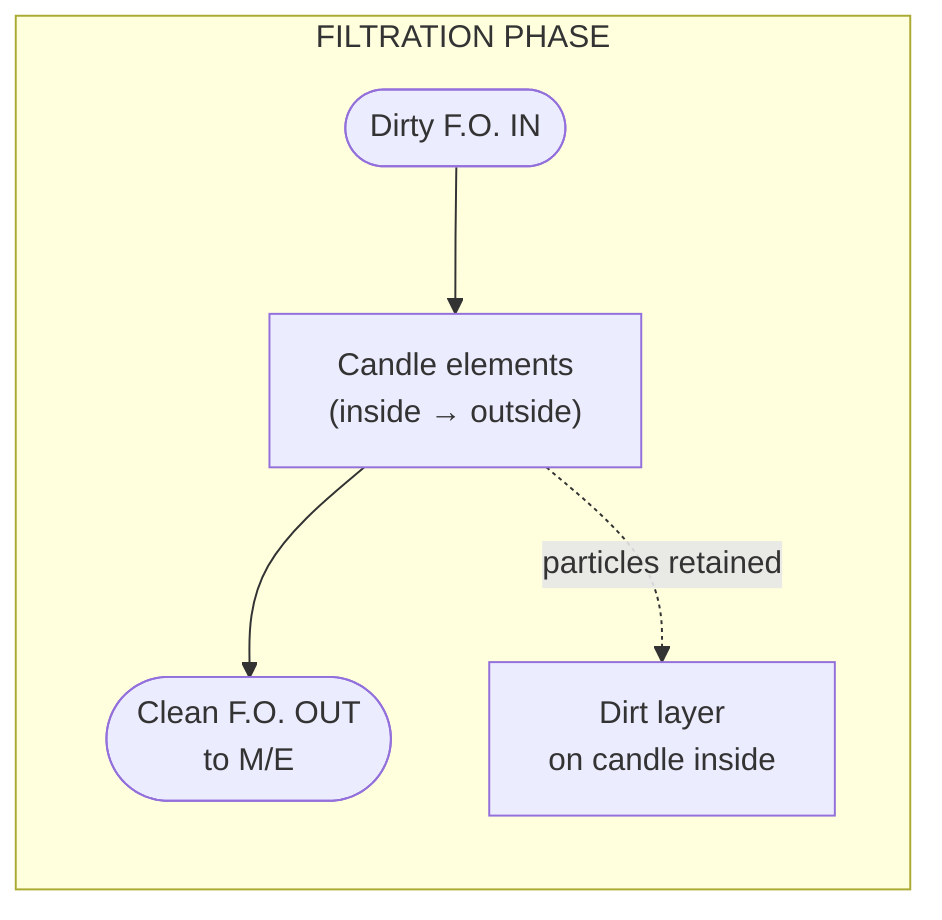
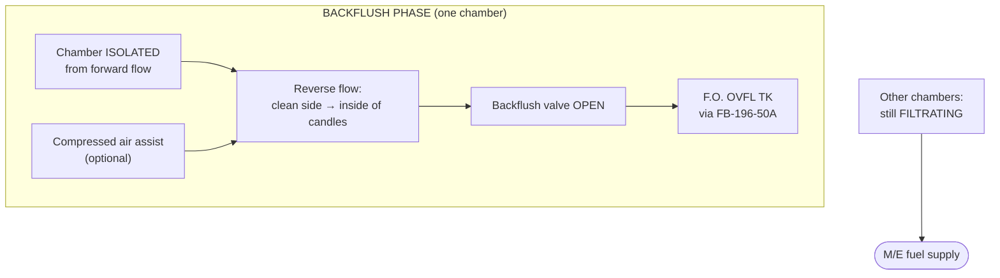
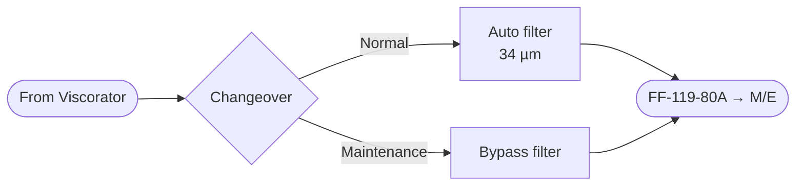

# M/E F.O. Auto Back-Flushing Filter — How It Works (Filtration & Backflush)

> **Updated reference:** Use **[boll-6.61-filtration-backflush-animation.md](boll-6.61-filtration-backflush-animation.md)** for submission — BOLL manual §5/§6: filtration is **outside → inside** (dirt on outside mesh).

**Project type:** Technical animation / submission (2D or 3D flow)  
**System:** M/E F.O. SERVICE SYSTEM — P&ID **2536–2540**  
**Equipment:** **M/E F.O. AUTO BACK-FLUSHING FILTER (ABS. 34 µm)** + bypass (changeover)  
**Main engine:** HYUNDAI-WÄRTSILÄ **6RT-flex82T**

*For exact internal geometry, follow OEM manual. Diagrams below show standard operating principle for multichamber automatic backflush filters on fuel oil service.*

---

## 1. Two operating phases (overview)

| Phase | What happens | M/E still gets fuel? |
|-------|----------------|----------------------|
| **A — Filtration** | Dirty F.O. filtered; particles stay on candles; clean oil to **FF-119-80A** → rail | **Yes** (other chambers / paths filter) |
| **B — Backflushing** | One chamber (or segment) isolated; **reverse flow** + often **air assist**; dirt to **FB-196-50A → F.O. OVFL TK** | **Yes** (remaining chambers / bypass if fitted) |

**Start trigger (typical):** **DPS** (differential pressure) high **or** timer → signal to **MC / OPAH MC** control → backflush sequence.

---

## 2. Filtration phase — 2D flow (normal running)

### P&ID context

```text
[VISCORATOR] → INLET (EK-117-80A area) → [AUTO FILTER 34µm] → OUTLET FF-119-80A
                                                      ↓ (when backflushing)
                                              FB-196-50A → F.O. OVFL TK
```

### Inside one filter chamber (principle)

Fuel flows **from inside → outside** of each **candle element** (wire mesh / pleated candles). Dirt particles are trapped **on the inside surface** of the media.



### ASCII — single chamber, filtration

```text
        DIRTY F.O. IN  ──────►  │  ║ ║ ║  │  ──────►  CLEAN F.O. OUT
                              │  ║ ║ ║  │           (to FF-119-80A)
                              │  ║ ║ ║  │
                              └──╨═╨═╨──┘
                                 candles
                              ◄── flow ──
                              dirt builds INSIDE surface
```

**Instruments during filtration:** **PI** (inlet/outlet), **DPS** rises as dirt collects.

---

## 3. Backflushing phase — 2D flow (regeneration)

### Sequence (typical multichamber automatic filter)

1. **DPS** reaches setpoint (or timer).  
2. **Selector / control** isolates **one dirty chamber** from forward flow.  
3. **Backflush discharge valve** opens (line toward **F.O. OVFL TK**).  
4. **Compressed air** (if fitted) pushes a small volume of **clean oil** **backward** through candles.  
5. Dirt stripped from candle surface → discharged with small flush volume → **FB-196-50A**.  
6. Chamber refills / vents; chamber returns to **standby** or **filtration**.  
7. Other chambers continue **filtration** → **no total loss of supply** to M/E.



### ASCII — backflush (one chamber)

```text
   OTHER CHAMBERS ──► still filtering ──► CLEAN to M/E

   ISOLATED CHAMBER:
        ┌─────────────────┐
        │  ║ ║ ║ candles   │
        │  ◄── REVERSE ──  │  ← clean oil + air pulse
        │     flush       │
        └────────┬────────┘
                 │ dirty flush + particles
                 ▼
           BACKFLUSH VALVE
                 │
                 ▼
           F.O. OVFL TK  (FB-196-50A)
```

**After backflush:** **DPS** drops; cycle repeats on next chamber until all cleaned or setpoint OK.

---

## 4. Duplex / bypass (P&ID — for context only)

During **normal operation**, flow is through the **auto filter**.  
**Bypass filter** is used when **changeover** is shifted for **maintenance** — not the same as automatic backflush cycle.



*Animation project can show bypass in a separate 5 s clip or omit if submission is “auto filter only”.*

---

## 5. Storyboard for 2D / 3D animation (submission)

| Scene | Duration | Phase | Visual |
|-------|----------|-------|--------|
| 1 | 5 s | Title | M/E F.O. Auto Back-Flushing Filter — 34 µm |
| 2 | 15 s | System | Full line: viscorator → filter → accumulator → rail |
| 3 | 20 s | **Filtration** | Arrows **in → through candles → out**; DPS low/green |
| 4 | 5 s | Trigger | DPS rises → alarm on **MC** |
| 5 | 25 s | **Backflush** | One chamber highlights; reverse arrows; flow to **OVFL TK** |
| 6 | 10 s | Return | DPS normal; all chambers filtering |
| 7 | 5 s | End | Disclaimer: schematic — refer to ship manual |

**Total:** ~1.5–2 min (adjust to school/company requirement).

---

## 6. How to build the animation

### Option A — 2D (fastest, good for submission)

| Tool | Use for |
|------|---------|
| **PowerPoint / Google Slides** | Animated arrows, morph between slides |
| **Canva** | Icons + motion paths |
| **After Effects / CapCut** | Arrow overlays on still P&ID |
| **Mermaid / draw.io** | Export PNG → animate in editor |

**Steps:**  
1. Export P&ID crop (filter only) as background.  
2. Layer 2: coloured arrows (blue = clean, red/brown = dirty).  
3. Scene 3: loop forward arrows.  
4. Scene 5: hide forward on one chamber; show reverse to tank.

### Option B — 3D (more impressive)

| Tool | Notes |
|------|--------|
| **Blender** (free) | Model simple cylinder housing + tube candles; fluid arrow particles |
| **SolidWorks / Inventor** | If school has license — flow simulation simplified |
| **AI video** (Runway, etc.) | Background only; **add correct arrows in post** |

**Simple 3D model parts:** housing, 4–6 candle tubes, inlet flange, outlet flange, small branch to overflow tank.

### Option C — AI + manual labels (hybrid)

1. Generate generic “fuel oil filter cross section” image.  
2. Overlay **your** labels: FF-119-80A, FB-196-50A, 34 µm.  
3. Animate arrows in CapCut — **you control the physics**, not the AI.

---

## 7. Taglish narration script (function video)

**Filtration:**  
*"Sa filtration phase, ang dirty fuel oil ay pumapasok sa loob ng candle elements. Ang flow ay inside to outside. Ang mga particle na mas malaki sa thirty-four micron ay natitira sa candle, at ang malinis na fuel oil ay dumadaan papunta sa main engine supply line, FF-119-80A."*

**Trigger:**  
*"Kapag tumataas ang differential pressure, ang DPS ay nagse-signal sa control unit, MC, at magsisimula ang backflushing cycle."*

**Backflush:**  
*"Sa backflushing phase, ang isang chamber ay ini-isolate. Bubuksan ang backflush valve at ang contaminants ay tinatanggal ng reverse flow, kadalasang may tulong ang compressed air. Ang flushing fluid ay dumadaan sa linya papunta sa fuel oil overflow tank, FB-196-50A. Habang nagba-backflush ang isang chamber, ang iba ay nagfi-filter pa rin para tuloy ang supply sa engine."*

---

## 8. Checklist before submit

- [ ] Clear title: **Filtration phase** vs **Backflushing phase** (two sections)  
- [ ] Arrow direction labelled (IN / OUT / TO OVFL TK)  
- [ ] Mention **34 µm ABS** and **DPS → MC**  
- [ ] Note: schematic — not ship-specific interlocks  
- [ ] Length meets requirement (often 2–5 min)  
- [ ] Export **MP4 1080p**

---

## 9. Files in this repo

| File | Purpose |
|------|---------|
| This document | 2D mermaid + ASCII + storyboard + tools |
| `me-fo-taglish-candle-maintenance.md` | Maintenance (separate project) |
| `assets/` | Put exported frames / P&ID crops here (optional) |

When you submit your reference sample, match **scene count and format** to that template; core technical content above stays valid.
